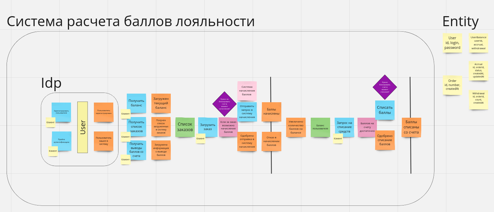
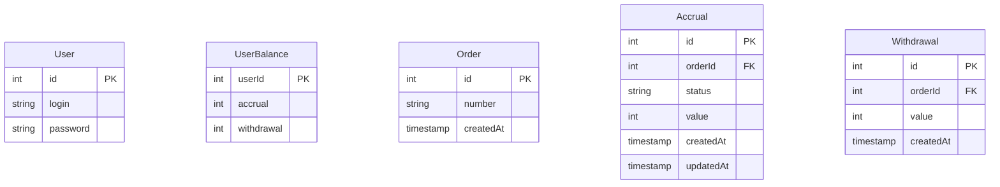
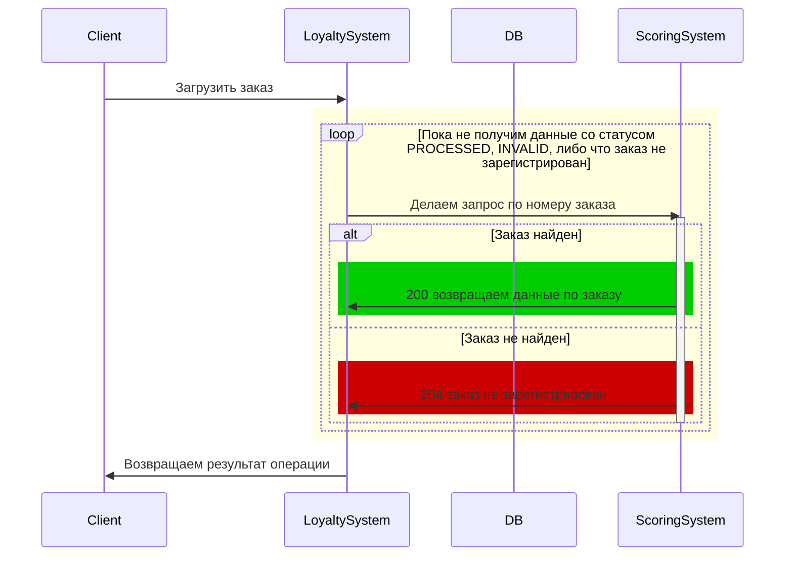

https://miro.com/app/board/uXjVKJX4m7E=/?share_link_id=670000264537

```mermaid
erDiagram
User {
    int id PK
    string login
    string password
}

UserBalance {
    int userId PK
    int accrual
    int withdrawal
}

Order {
    int id PK
    string number
    timestamp createdAt 
}

Accrual {
    int id PK
    int orderId FK
    string status
    int value
    timestamp createdAt
    timestamp updatedAt
}

Withdrawal {
    int id PK
    int orderId FK
    int value
    timestamp createdAt
}
```

```mermaid
sequenceDiagram
    participant Client
    participant LoyaltySystem
    participant DB
    participant ScoringSystem
    
    Client->>LoyaltySystem: Загрузить заказ
    rect rgb(255, 255, 224)
       loop Пока не получим данные со статусом PROCESSED, INVALID, либо что заказ не зарегистрирован 
          LoyaltySystem->>ScoringSystem: Делаем запрос по номеру заказа
          activate ScoringSystem
          alt Заказ найден
              rect rgb(0,204,0)
                  ScoringSystem->>LoyaltySystem: 200 возвращаем данные по заказу 
              end
          else Заказ не найден
              rect rgb(204,0,0)
                  ScoringSystem->>LoyaltySystem: 204 заказ не зарегистрирован
              end
          end
          deactivate ScoringSystem
       end
    end
    LoyaltySystem->>Client: Возвращаем результат операции
```
