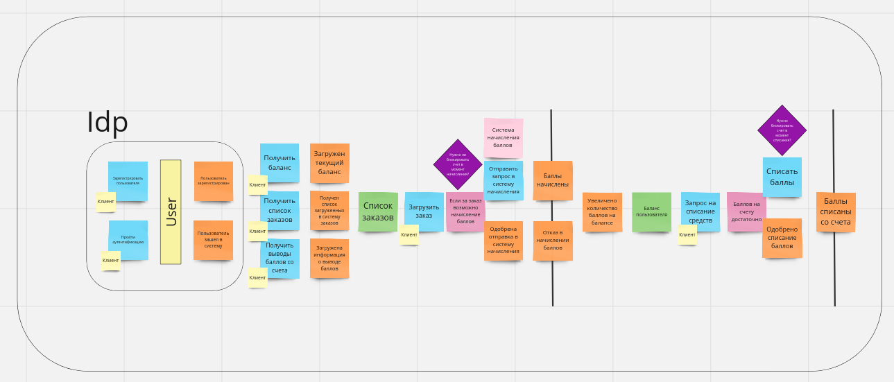
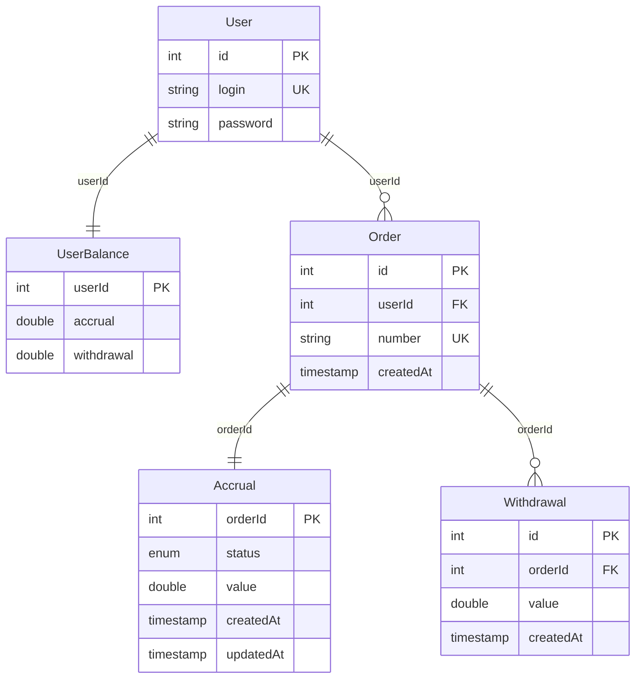
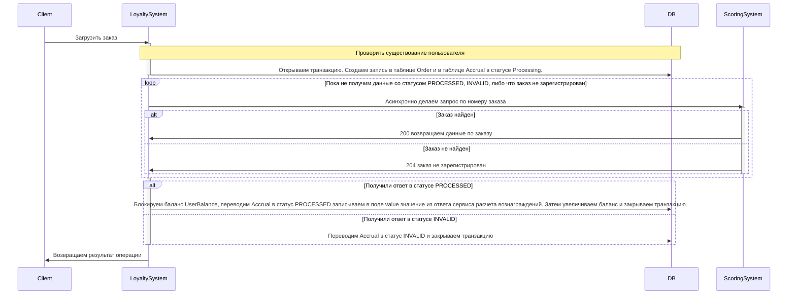
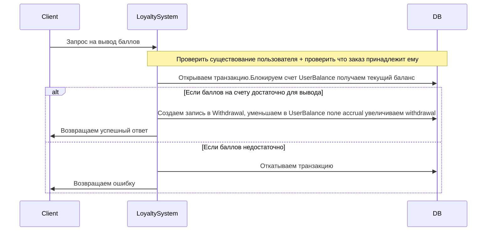

## Event stroming накопительная система лояльности «Гофермарт»
 
https://miro.com/app/board/uXjVKJX4m7E=/?share_link_id=670000264537

## Таблицы бд

## Диаграмма последовательности для операции загрузки заказа

## Диаграмма последовательности для операции вывода баллов
